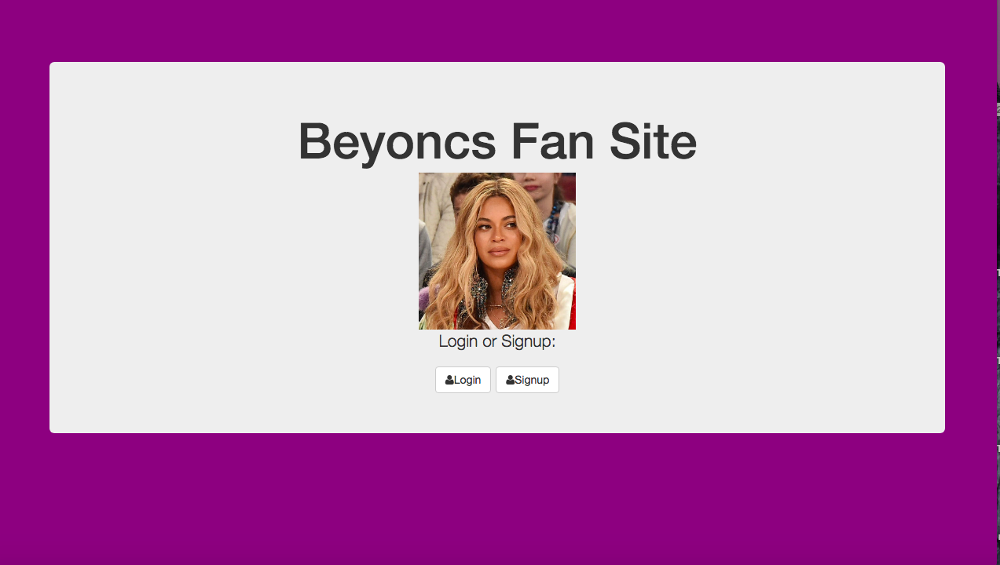

## Installation

1. Clone repo
2. run `npm install`

## Usage

1. run `node server.js`
2. Navigate to `localhost:8080`

# Full Stack Beyonce Fan Site
In this assignment, I created a fan site for Beyonce fans to interact with one another about the artist we all love.

## How It's Made:

**Tech used:** HTML, CSS, JavaScript, ES6, Mongo DB, Express.js, Node.js

I used Mongo DB to save the user information, information about the messages, and the emoji reactions to messages. I used Express.js and Node.js for the backend. I used HTML5, CSS3, and JavaScript to construct the webpage.

## Examples:
Take a look at these couple examples that I have in my own portfolio:

**FULL STACK ShareYourSecrets:** https://github.com/aliaabdulahi/FULLSTACK-SecretShare

**FULL STACK Vacation-app:** https://github.com/aliaabdulahi/FULL-STACK-Vacation-Express

**FULL STACK Kanye-west-app:** https://github.com/aliaabdulahi/Kanye-ExFans-Express
